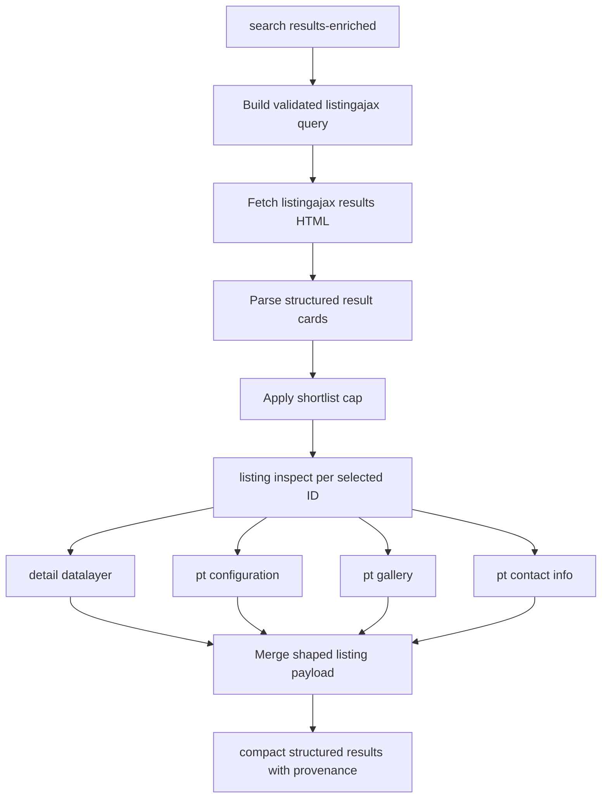

# Plan: Add API-first listing detail and enriched search workflows

## Summary

Extend the website-backed Idealista CLI from raw endpoint wrappers into shaped, low-volume listing workflows. The plan adds structured result-card extraction, a first-class listing inspection command, and shortlist-first enriched search on top of the HAR-validated website endpoints without introducing browser automation into the runtime path.

---

## Problem Frame

The CLI now exposes the right website-native building blocks, but the user-facing surface still stops too early:

- `search results-live` and `search totals-live` call the observed website endpoints, but return raw response bodies instead of shaped listing data.
- detail data exists across multiple endpoints, but only `listing photos` composes them into an operator-friendly payload.
- agent usage is still too verbose for the new search/detail flows unless the caller manually trims fields.

That leaves the repo in an awkward middle state: API-first in transport, but not yet API-first in the operator experience. The next layer should behave like a normal website client, fetch only what is needed, and return compact structured payloads that support later ranking or yield analysis.

---

## Requirements

### Website-native retrieval

- R1. The next search and listing workflows must use the website's observed internal HTTP endpoints rather than browser automation, DOM driving, or headless capture in the runtime path.
- R2. Result-list retrieval must stay bound to the HAR-validated `listingajax.ajax` contract and its sibling totals endpoint, reusing the existing supported filter subset instead of inventing a second query grammar.
- R3. Listing detail aggregation must compose the existing detail, configuration, gallery, and contact endpoints into a single read-only high-level workflow.

### Conservative fetch behavior

- R4. Enriched search must be shortlist-first: fetch result cards first, then enrich only a bounded selected subset of listing IDs instead of fan-out over every result by default.
- R5. The new high-level flows must make challenge or interstitial responses explicit so the operator can distinguish "blocked website session" from "empty search results" or "missing listing."

### Agent-safe output

- R6. The shaped search and listing workflows must return structured payloads that work cleanly with the existing provenance, `--select`, `--compact`, and `--agent` output pipeline.
- R7. The default response shape for the new high-level flows must prioritize key listing fields over raw website payloads so token usage stays low without forcing every caller to handcraft `--select`.

### Scope boundary

- R8. This plan does not include student-rental profitability scoring or mortgage analysis; it prepares the website-native data retrieval layer those later workflows can consume.

---

## Key Technical Decisions

- KTD1. Keep the runtime transport website-native and session-backed, not browser-backed. The CLI should only call the website endpoints captured in HARs and should not depend on browser automation except for contract discovery or cookie refresh support.
- KTD2. Treat `listingajax.ajax` as a parsing surface, not an opaque passthrough. Returning raw HTML is useful for debugging, but the primary operator workflow should extract stable listing-card fields and emit structured items.
- KTD3. Add a first-class `listing inspect` workflow before building enriched search. A single-listing aggregator becomes the shared detail primitive that enriched search can call, which keeps the search command from absorbing unrelated detail-merging logic.
- KTD4. Default enriched search to shortlist-first behavior with an explicit cap. This keeps request volume closer to a normal user journey and avoids broad multi-endpoint fan-out when result pages are large.
- KTD5. Reuse the existing output filtering pipeline instead of inventing command-specific compact modes. The new workflows should shape useful data up front, then rely on `wrapWithProvenance`, `--compact`, and `--select` for final output trimming.

---

## High-Level Technical Design

The architectural seam is simple:

- result-card parsing is the bridge between raw `listingajax.ajax` HTML and structured search output.
- `listing inspect` is the shared detail aggregator.
- enriched search orchestrates the two without owning the detail-merging rules itself.

This keeps the search flow conservative and makes it easy to reuse the same inspection surface for later shortlist ranking commands.

---

## Scope Boundaries

### In scope

- structured extraction of listing cards from the website results endpoint
- a single-listing inspection command that merges existing detail endpoints
- shortlist-first enriched search built on top of result parsing plus listing inspection
- challenge-aware and token-efficient output shaping for these workflows

### Deferred to Follow-Up Work

- scoring listings for student rental profitability
- mortgage affordability calculations
- ranking or recommendation heuristics over enriched listings
- persistence or sync of enriched website-specific listing summaries into the local store

### Outside this plan

- browser automation as part of normal CLI runtime
- bulk crawling behavior over many pages of results by default
- cookie acquisition or anti-bot bypass work beyond existing session tooling

---

## System-Wide Impact

- The `listing` command group becomes the main home for shaped high-level listing workflows instead of leaving composition scattered across raw endpoint commands.
- The `search` surface moves from "URL builder plus raw endpoint access" toward a true website-native search workflow while preserving the current validated filter grammar.
- MCP parity matters: if the CLI gains shaped listing inspection or enriched search, the tool surface should remain discoverable for agent consumers, even if the first iteration is CLI-first.

---

## Risks & Dependencies

- The website results endpoint returns HTML, not JSON. Parsing must anchor to stable card-level structures or embedded identifiers so the workflow fails clearly when markup drifts.
- DataDome or similar interstitials are already part of the live behavior. The plan must classify challenge pages early so shaped search does not silently emit empty parsed results.
- Contact and configuration payloads may be noisier or less stable than datalayer and gallery payloads. The merged listing contract should tolerate partial enrichment without treating every missing secondary field as total failure.

---

## Implementation Units

### U1. Shape listingajax results into structured cards

- **Goal:** Turn the raw website results endpoint into structured listing-card data the CLI can reason about.
- **Requirements:** R1, R2, R5, R6, R7
- **Dependencies:** None
- **Files:** `internal/cli/search.go`, `internal/cli/search_results.go`, `internal/cli/search_test.go`, `internal/cli/site_dogfood_test.go`
- **Approach:** Add a parsing layer for `search results-live` so the command can emit structured items extracted from the results HTML rather than only returning the raw body. Preserve enough debug information to inspect the source body when needed, but make the primary output listing-centric. Detect known challenge/interstitial shapes before parsing and return a classified error path instead of an empty item list.
- **Patterns to follow:** the existing `buildSearchResultsState(...)` contract in `internal/cli/search_results.go`; the provenance-aware JSON path in `outputWebsiteSearchPayload(...)`; the interstitial classification shape already used in `internal/cli/doctor.go`
- **Test scenarios:**
  - parse a representative results HTML sample and extract listing IDs, links, and price-like card fields into structured items
  - preserve stable filter/query metadata alongside parsed results so callers can inspect the request context
  - return a classified auth/session error when the response body matches a DataDome-style challenge page
  - keep `--dry-run` output request-focused and free of parsing expectations
  - preserve compact/provenance behavior when the parsed results are emitted through the standard output helpers
- **Verification:** A caller can run `search results-live` and receive structured listing items plus request context, while blocked sessions fail explicitly instead of degrading into empty parsed results.

### U2. Add a first-class listing inspection workflow

- **Goal:** Introduce a single high-level command that aggregates the existing listing detail endpoints into one shaped listing payload.
- **Requirements:** R1, R3, R5, R6, R7
- **Dependencies:** U1
- **Files:** `internal/cli/listing_photos.go`, `internal/cli/listing_inspect.go`, `internal/cli/listing_inspect_test.go`, `internal/cli/which.go`, `README.md`, `SKILL.md`
- **Approach:** Keep `listing photos` focused on media, then add `listing inspect <listing_id>` as the general detail aggregator. Merge datalayer, configuration, gallery, and contact info into a single structured response with tolerant partial enrichment. The merged contract should expose key commercial and location fields first, with secondary nested data available but not required.
- **Execution note:** Start with fixture-backed aggregation coverage before tuning the final field set so the merged contract stays stable while the payload shape is refined.
- **Patterns to follow:** `runListingPhotos(...)` and `summarizeListingPhotos(...)` in `internal/cli/listing_photos.go`; the existing raw detail and pt endpoint wrappers for transport and provenance behavior
- **Test scenarios:**
  - merge datalayer, configuration, gallery, and contact fixtures into one listing-inspect payload
  - tolerate missing or partial secondary endpoints while still returning the primary listing identity and core detail fields
  - expose gallery/media fields consistently with the existing listing-photos workflow rather than creating conflicting field names
  - classify blocked session responses clearly when any required primary endpoint returns an interstitial page
  - confirm command discovery surfaces `listing inspect` through `which`
- **Verification:** A caller can inspect one listing ID and get a single shaped payload without manually chaining four lower-level commands.

### U3. Build shortlist-first enriched search on top of listing inspection

- **Goal:** Add a high-level search workflow that fetches result cards, then enriches only a bounded shortlist of listings through `listing inspect`.
- **Requirements:** R1, R2, R3, R4, R5, R6, R7, R8
- **Dependencies:** U1, U2
- **Files:** `internal/cli/search.go`, `internal/cli/search_test.go`, `internal/cli/which.go`, `README.md`, `SKILL.md`
- **Approach:** Introduce a new `search results-enriched` command that reuses the validated filter grammar, parses result cards, applies a default shortlist cap, and then calls the shared listing inspection path for those selected IDs. The output should separate raw search metadata from enriched listing items so later ranking logic has a clean base to build on. The command should support a configurable cap but remain conservative by default.
- **Patterns to follow:** the new `results-live` and `totals-live` command family for request construction; the planned `listing inspect` aggregator from U2; the current `which` and README feature indexing for surfaced workflows
- **Test scenarios:**
  - enrich only the first N selected listings instead of all parsed result cards when a larger page is returned
  - preserve parsed result-card fields even when one shortlisted listing fails secondary enrichment
  - return empty enriched items with valid search metadata when no listings are parsed from a successful empty-results page
  - classify blocked website responses before the shortlist fan-out begins
  - ensure the new command remains discoverable through `which` and documented examples
- **Verification:** A caller can request enriched results for a filter set and receive a bounded structured shortlist without manual ID extraction or multi-command chaining.

### U4. Tighten token-efficient output defaults for the new workflows

- **Goal:** Ensure the new high-level search and listing commands are compact enough for agent use without sacrificing inspectability.
- **Requirements:** R6, R7
- **Dependencies:** U1, U2, U3
- **Files:** `internal/cli/helpers.go`, `internal/cli/search.go`, `internal/cli/listing_inspect.go`, `internal/cli/search_test.go`, `internal/cli/listing_inspect_test.go`
- **Approach:** Audit the shaped payloads introduced in U1-U3 against the current `compactFields(...)` heuristics. If the default compaction keeps noisy nested metadata or drops useful listing identity fields, extend the compact helpers so the new workflows degrade cleanly under `--agent` and `--compact`. Prefer shared output rules over one-off per-command special cases unless a field shape makes the shared path impossible.
- **Patterns to follow:** `compactFields(...)`, `compactListFields(...)`, and `compactObjectFields(...)` in `internal/cli/helpers.go`; the current high-level `outputWebsiteSearchPayload(...)` flow
- **Test scenarios:**
  - keep listing identity, link, price, and high-gravity summary fields under `--compact` for shaped search and inspect payloads
  - strip large nested raw payloads or verbose metadata from compact output when they do not help agent routing
  - preserve `--select` precedence over `--compact` on the new commands
  - confirm provenance wrapping still works after compact projection
- **Verification:** The new high-level commands are usable under `--agent` without forcing downstream callers to overuse `--select` just to keep responses small.

---

## Sources & Research

- `internal/cli/search_results.go` already owns the validated website filter grammar and is the correct place to keep shared listingajax query construction.
- `internal/cli/search.go` now exposes `results-live` and `totals-live`, which provides the operator entry point for the next shaped search layer.
- `internal/cli/listing_photos.go` is the existing example of a high-level composed website workflow and should anchor the new `listing inspect` design.
- `internal/cli/helpers.go` already contains the compact/provenance output machinery that should be reused instead of bypassed.
- `internal/cli/site_dogfood_test.go` is the current live-website smoke surface and should absorb the new shaped search/detail workflows once the command contracts settle.

